# Una pregunta para empezar {background-color="#00344f" background-image="images/background_fish.gif" background-size="cover" background-opacity="0.25"}

---

## {background-color="black"}

  <iframe 
    sandbox='allow-popups allow-scripts allow-same-origin allow-presentation' 
    allowfullscreen='true' 
    allowtransparency='true' 
    frameborder='0' 
    height='300' 
    src='https://www.mentimeter.com/app/presentation/alapizk2q7g6insiwa4r7vzjrogc7oyk/embed'
    style='position: absolute; top: 0; left: 0; width: 100%; height: 100%;' width='300'>
  </iframe>

---

## ¿Cómo estudiamos algo que cambia todo el tiempo y que no podemos observar por completo?

::: {.callout-note appearance="minimal"}
El océano cambia. El clima cambia. Las pesquerías cambian.
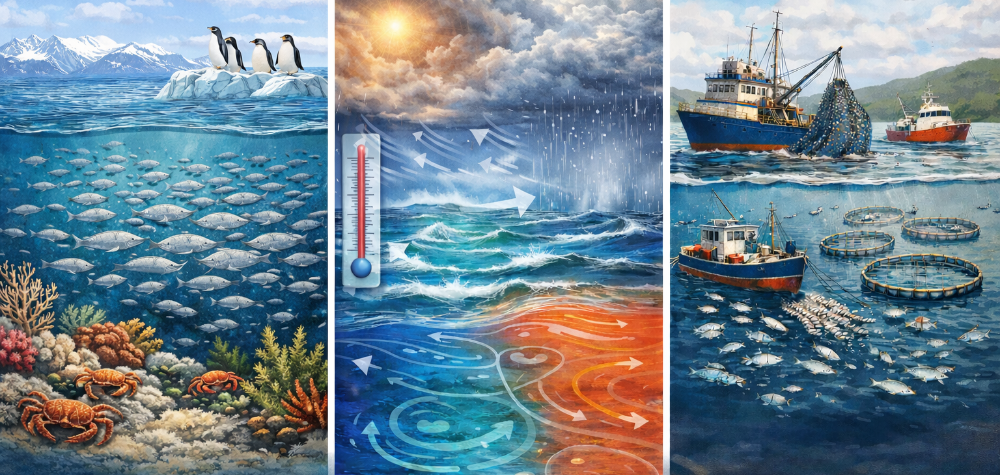{width="100%" fig-align="center" style="border-radius:12px;"}

Y, aun así, necesitamos **entender**, **modelar** y **tomar decisiones**.
:::

---

## Esta charla no trata solo de pesca

### También trata de:

:::: {.columns .v-center}
::: {.column width="45%"}

\vspace{0.4em}

- **datos** que ayudan a mirar sistemas complejos;
- **modelos** para transformar observaciones en conocimiento;
- **computación** para analizar, simular y predecir;
- **ciencia aplicada** para responder preguntas reales del país;
- **trabajo interdisciplinario** para conectar distintas miradas.

:::

::: {.column width="55%"}

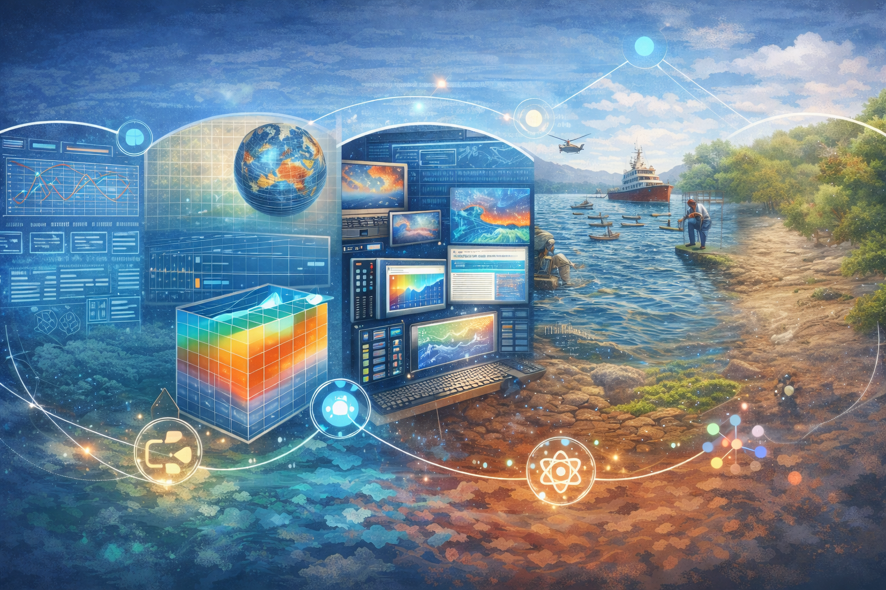{fig-align="center" width="100%" style="border-radius: 14px; box-shadow: 0 6px 18px rgba(0,0,0,0.18);"}

:::
::::

# El problema: mar, clima y decisiones {background-color="#00344f" background-image="images/background_fish.gif" background-size="cover" background-opacity="0.25"}

## Chile y el mar

::: {.callout-note appearance="minimal"}
Chile es un país profundamente conectado con el océano.

Lo que ocurre en el mar afecta ecosistemas, pesquerías, economía, territorio y decisiones públicas.

Por eso, entender la relación entre **ambiente**, **recursos marinos** y **cambio climático** no es solo un desafío científico: también es un desafío social.
:::

:::: {.columns}
::: {.column width="30%"}

::: {.fragment .fade-up fragment-index=1}
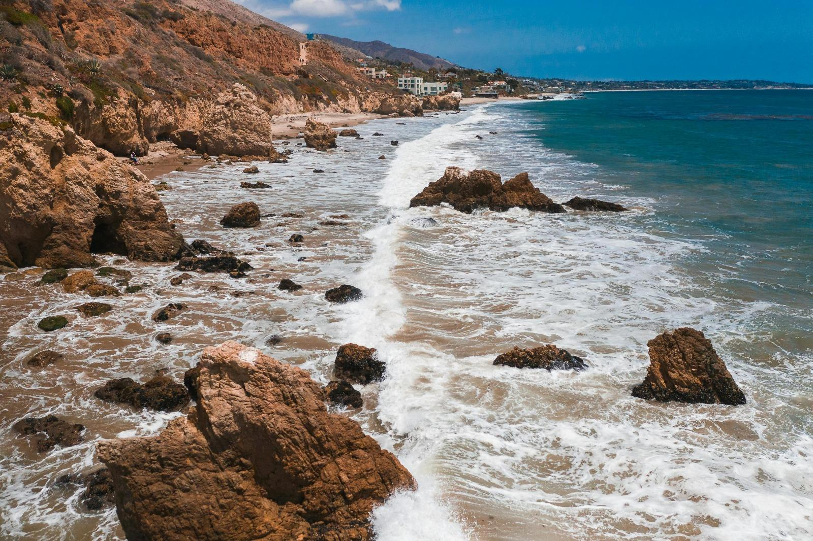{fig-alt="Costa y territorio" style="width:100%; height:220px; object-fit:cover; border-radius:10px;"}

Territorio y vida costera

:::

:::

::: {.column width="30%"}

::: {.fragment .fade-up fragment-index=2}
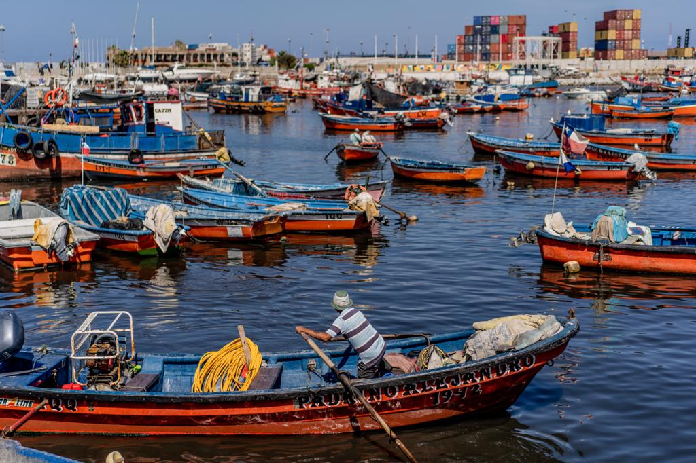{fig-alt="Pesquerías y economía" style="width:100%; height:220px; object-fit:cover; border-radius:10px;"}

Pesquerías y economía

:::

:::

::: {.column width="40%"}

::: {.fragment .fade-up fragment-index=3}
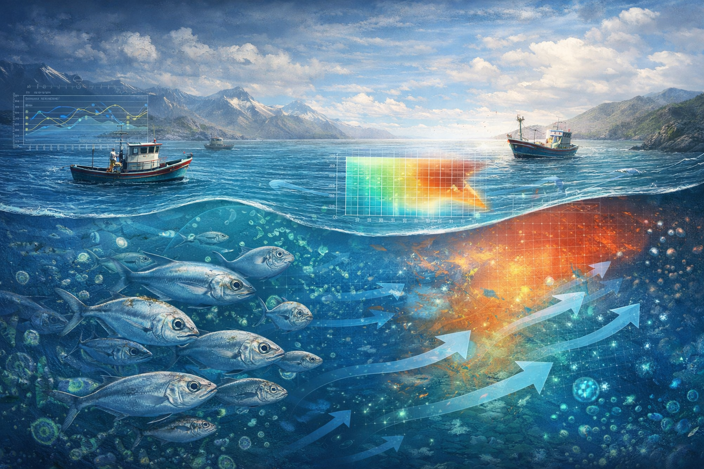{fig-alt="Ambiente, recursos marinos y cambio climático" style="width:100%; height:220px; object-fit:cover; border-radius:10px;"}

Ambiente, recursos marinos y cambio climático

:::

:::
::::

---

## ¿Qué hay bajo la superficie?

::::{.r-stack}

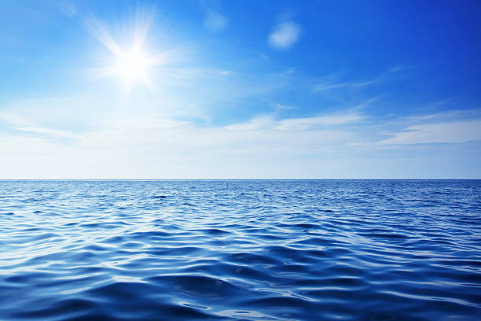{.fragment .fade-in-then-out fragment-index=1 fig-alt="Superficie del océano" style="display:block; margin:1.5rem auto 0 auto; width:900px; height:520px; object-fit:cover; border-radius:12px;"}

::: {.fragment .fade-in-then-out fragment-index=2}

  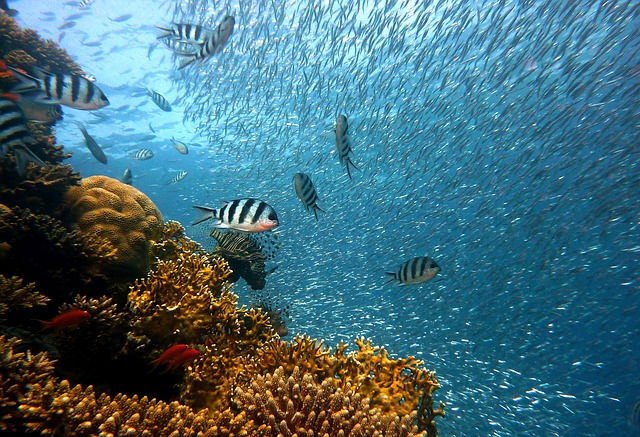
  

    Cardúmenes y biodiversidad
  

:::

::: {.fragment .fade-in-then-out fragment-index=2}

  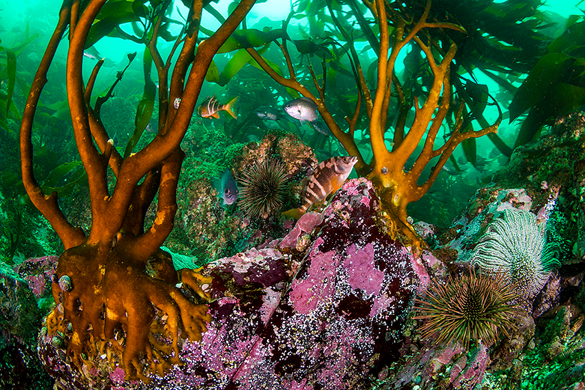
  

    Bosques de algas y hábitats marinos
  

:::

::: {.fragment .fade-in-then-out fragment-index=2}

  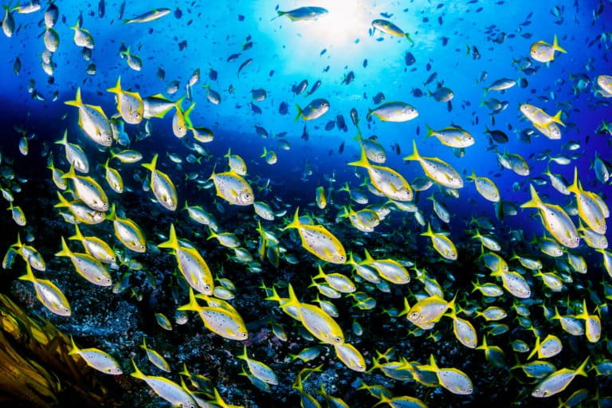
  

    Ecosistemas y vida bajo la superficie
  

:::

::: {.fragment .fade-in-then-out fragment-index=2}

  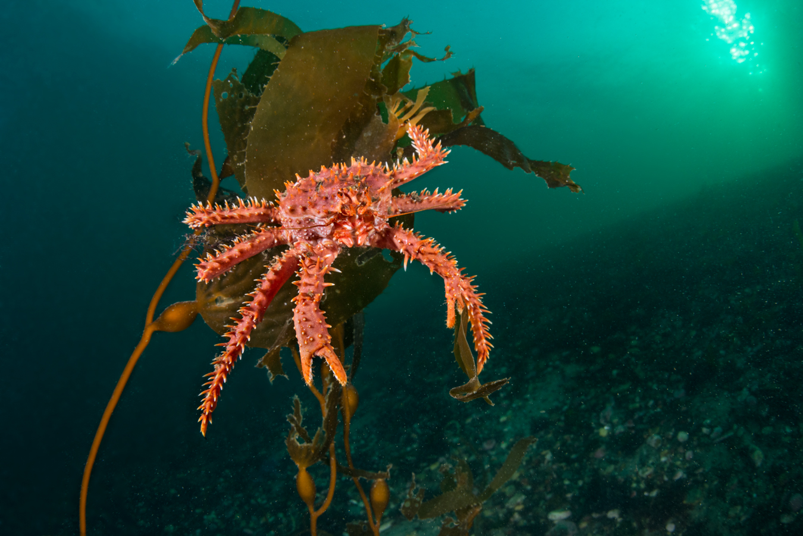
  

    Especies, interacciones y complejidad
  

:::

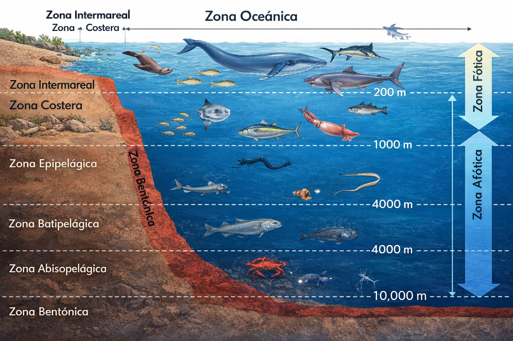{.fragment .fade-in-then-out fragment-index=3 fig-alt="Zonas del océano" style="display:block; margin:1.5rem auto 0 auto; width:950px; height:520px; object-fit:contain; border-radius:12px; background:white;"}

::::

---

## Un sistema complejo

::: {.callout-tip appearance="minimal" title="Ambiente y recursos"}
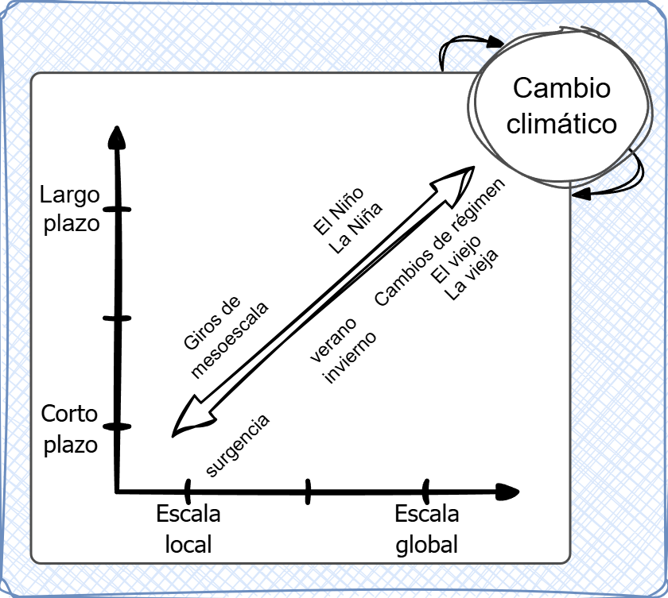{width=65%}
:::

---

::: {.callout-tip appearance="minimal" title="Pesquerías"}
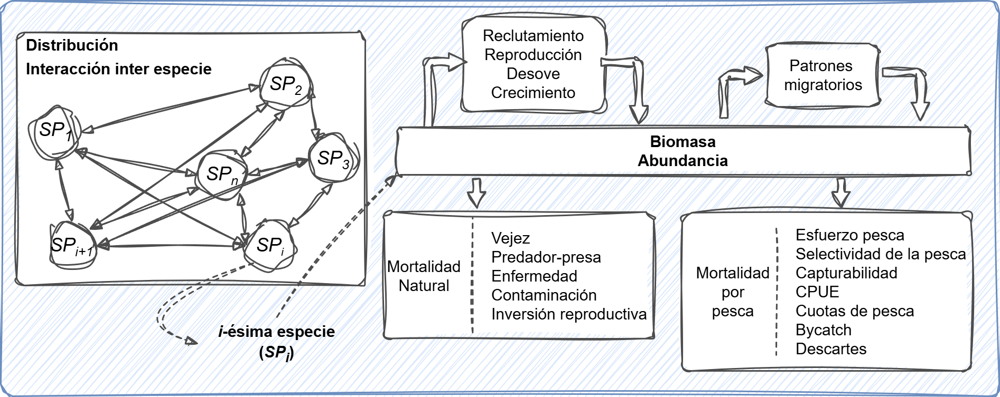
:::

# Del mar a los datos {background-color="#00344f" background-image="images/background_fish.gif" background-size="cover" background-opacity="0.25"}

## Un mar de datos

---

## Del dato al conocimiento

::: {.callout-note appearance="minimal"}
Estudiar problemas complejos del mundo real requiere observar, formular preguntas, construir modelos e interpretar resultados.
:::

:::: {.columns}

::: {.column width="33%"}
🌎 **Mundo real** →
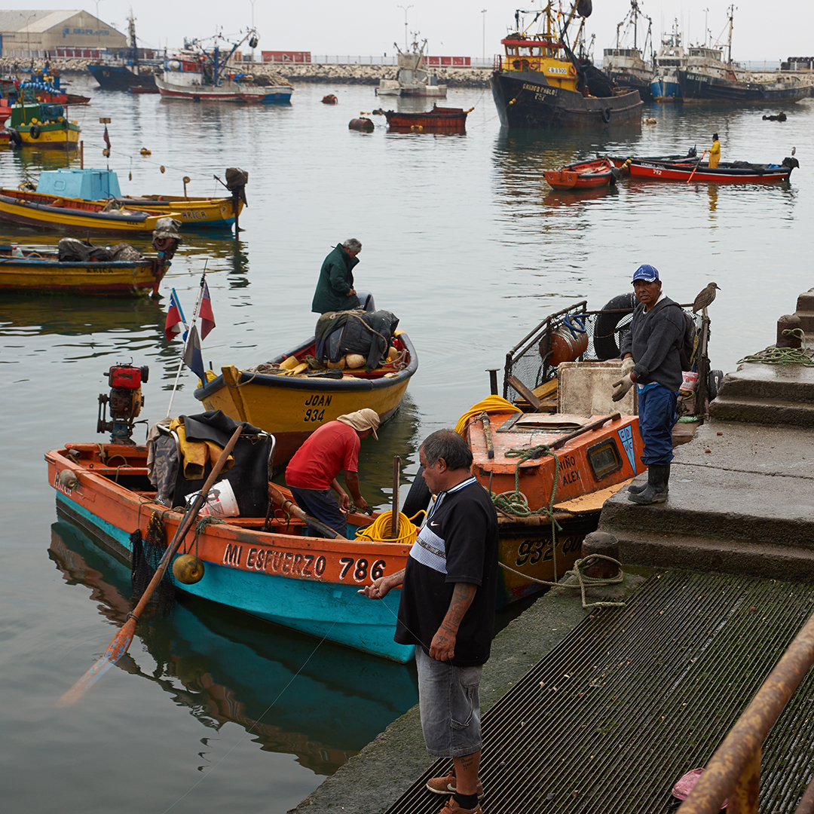{fig-alt="Mundo real" style="width:100%; height:220px; object-fit:cover; border-radius:12px; display:block;"}
problema, territorio y actores
:::

::: {.column width="33%"}
📊 **Datos y Modelos** →
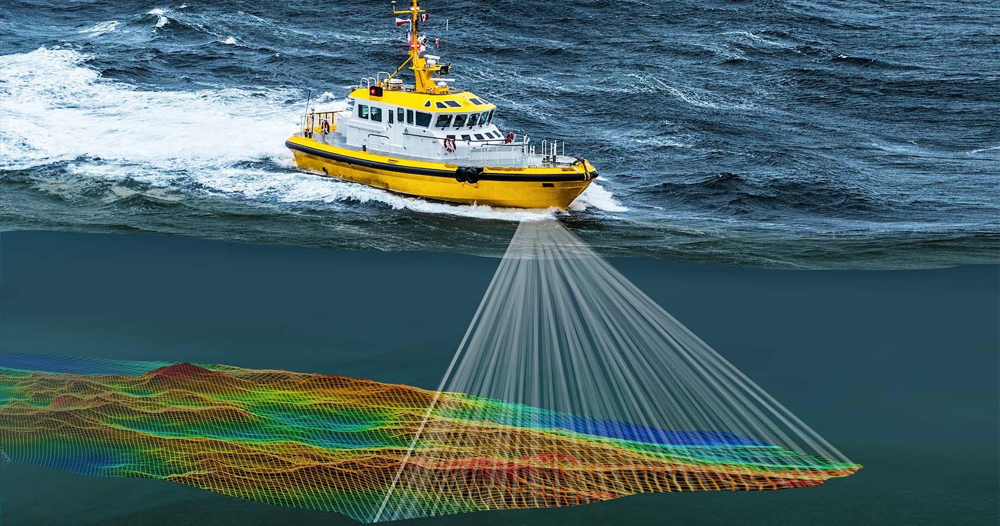{fig-alt="Datos y modelos" style="width:100%; height:220px; object-fit:cover; border-radius:12px; display:block;"}
observación, series de tiempo, datos espaciales, modelación, simulación de escenarios, y un extenso etc...
:::

::: {.column width="33%"}
🧭 **Decisiones**
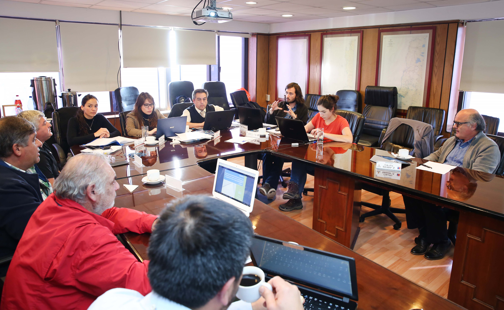{fig-alt="Decisiones" style="width:100%; height:220px; object-fit:cover; border-radius:12px; display:block;"}
conocimiento útil para apoyar acción
:::

::::

observaciones ambientales y pesqueras · series de tiempo · modelos estadísticos y matemáticos · simulación y aprendizaje automático · interpretación científica · comunicación de resultados

# ¿Dónde entra tu carrera? {background-color="#00344f" background-image="images/background_fish2.gif" background-size="cover" background-opacity="0.18"}

## Un mismo problema, muchas formas de aportar

::: {.columns}
::: {.column width="50%"}
::: {.callout-note appearance="minimal" title="Ingeniería Estadística"}
Inferencia, incertidumbre, predicción, validación de modelos y análisis de datos.
:::

::: {.callout-note appearance="minimal" title="Ingeniería Matemática"}
Modelación, estructuras dinámicas, optimización y abstracción de sistemas complejos.
:::

::: {.callout-note appearance="minimal" title="Computación científica / ciencia de datos"}
Programación, algoritmos, simulación, inteligencia artificial y procesamiento de datos.
:::
:::

::: {.column width="50%"}
::: {.callout-note appearance="minimal" title="Física e Ingeniería Física"}
Sistemas complejos, señales, procesos dinámicos, medición y comprensión del ambiente.
:::

::: {.callout-note appearance="minimal" title="Astrofísica con mención en Ciencia de Datos"}
Análisis cuantitativo, grandes volúmenes de datos, modelación y aprendizaje desde observaciones.
:::

::: {.callout-note appearance="minimal" title="Pedagogías"}
Comunicar ciencia, hacerla comprensible y conectar conocimiento con nuevas generaciones.
:::
:::
:::

---

## La invitación

::: {.callout-tip appearance="minimal"}
La pregunta no es solo **qué carrera estudias**, sino también:

**¿qué tipo de problemas te gustaría comprender o ayudar a resolver con las herramientas que aprenderás aquí?**
:::

# Un camino posible {background-color="#00344f" background-image="images/background_fish2.gif" background-size="cover" background-opacity="0.18"}

## Mi experiencia, como ejemplo y no como meta única

::: {.callout-note appearance="minimal"}
Mi camino ha estado en el cruce entre:

- el trabajo con problemas reales del mar y las pesquerías;
- el análisis de datos y la construcción de modelos;
- la colaboración con instituciones y equipos interdisciplinarios.

Hoy desarrollo docencia e investigación en la **USACH**, luego de una etapa en **IFOP**, y también participo en espacios técnico-científicos donde la evidencia puede aportar a decisiones reales.
:::

:::: {.columns}

::: {.column width="33%"}
::: {.fragment .fade-up fragment-index=1}
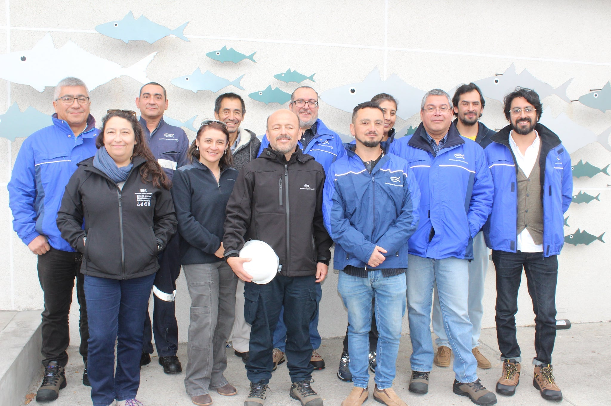{style="border-radius:12px; width:100%; height:180px; object-fit:cover;"}

Problemas reales / trabajo en terreno

:::
:::

::: {.column width="33%"}
::: {.fragment .fade-up fragment-index=2}
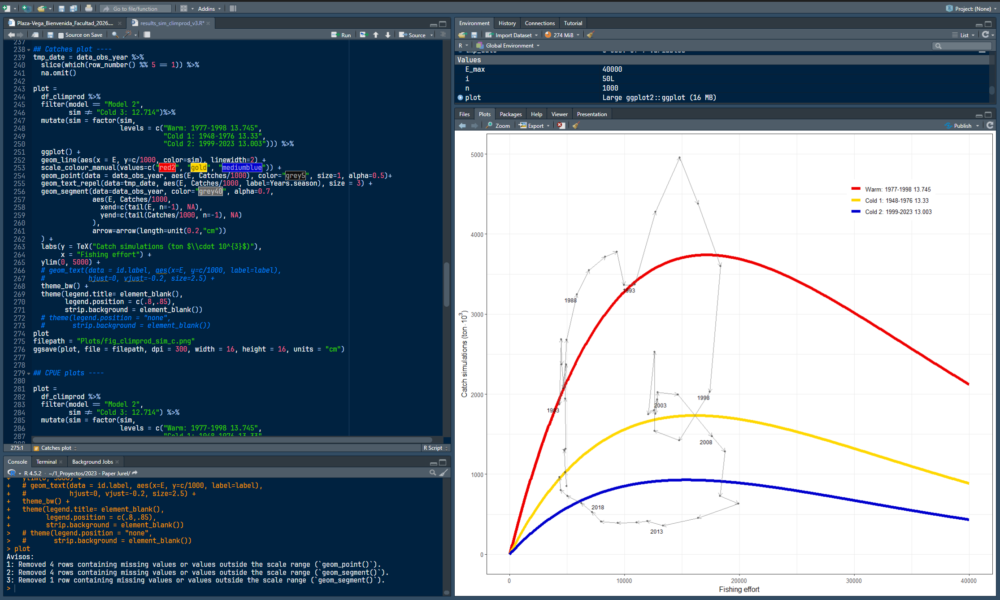{style="border-radius:12px; width:100%; height:180px; object-fit:contain; background:white;"}

Datos y modelos

:::
:::

::: {.column width="33%"}
::: {.fragment .fade-up fragment-index=3}
{style="border-radius:12px; width:100%; height:180px; object-fit:cover;"}

Trabajo colaborativo / decisiones

:::
:::

::::

---

## Lo importante del camino

::: {.callout-tip appearance="minimal"}
La idea no es que todos sigan una misma trayectoria.

La idea es mostrar que, desde distintas formaciones de la Facultad de Ciencia, sí es posible construir caminos que conecten curiosidad, herramientas y problemas reales.
:::

---

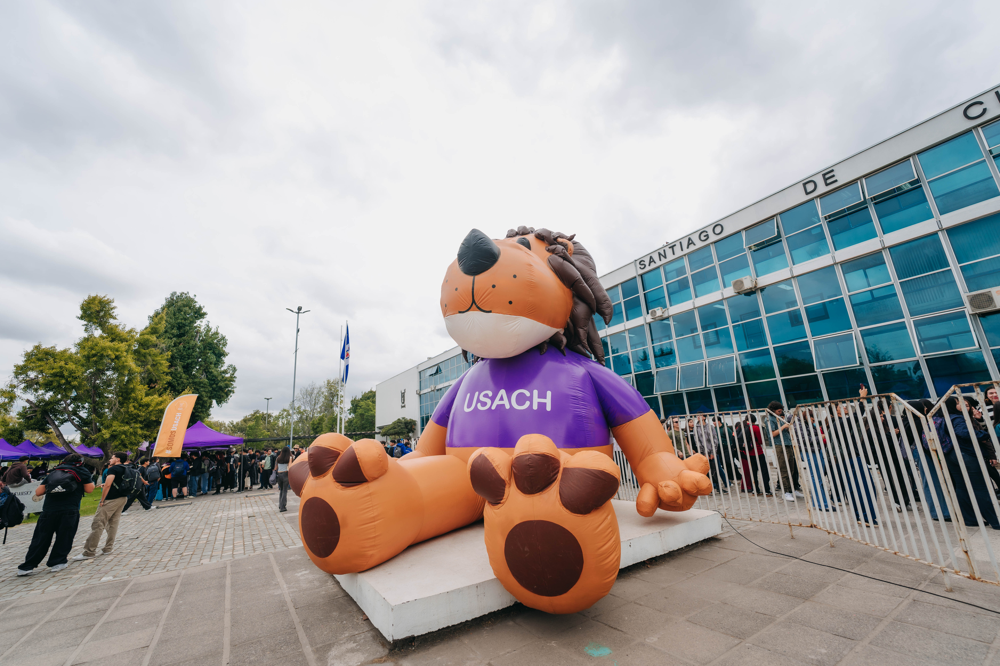{style="width:75%; display:block; margin:1.5rem auto; border-radius:16px;"}

::: {.fragment}

No hay una sola trayectoria.

:::

# Un proyecto en el que estado trabajando ahora último {background-color="#212f4b" background-image="images/background_fish2.gif" background-size="cover" background-opacity="0.18"}

## ¿De qué se trata?

::: {.callout-note appearance="minimal"}
El proyecto Fondecyt de Iniciación busca entender **cómo el cambio climático puede afectar a las pesquerías chilenas**. Para eso combina:

- datos ambientales y pesqueros;
- modelos estadísticos y de series de tiempo;
- herramientas de inteligencia artificial;
- simulación de escenarios futuros.
:::

:::: {.columns}

::: {.column width="25%"}
::: {.fragment}
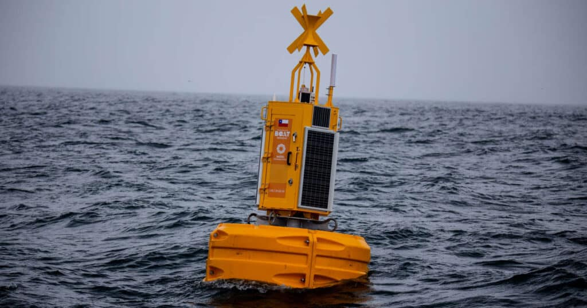{style="border-radius:10px; width:100%; height:120px; object-fit:cover;"}

Datos

:::
:::

::: {.column width="25%"}
::: {.fragment}
{style="border-radius:10px; width:100%; height:120px; object-fit:cover;"}

Modelos

:::
:::

::: {.column width="25%"}
::: {.fragment}
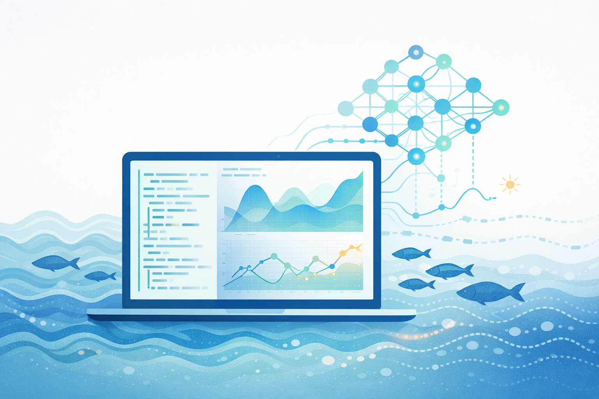{style="border-radius:10px; width:100%; height:120px; object-fit:cover;"}

Inteligencia Artificial

:::
:::

::: {.column width="25%"}
::: {.fragment}
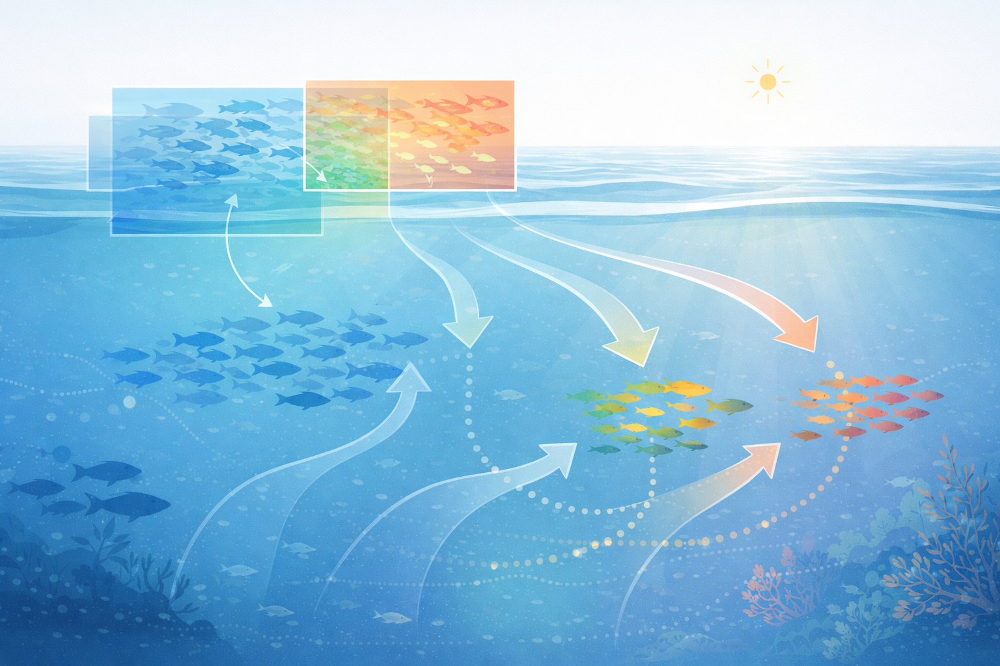{style="border-radius:10px; width:100%; height:120px; object-fit:cover;"}

Simulación de escenarios

:::
:::

::::

---

## La idea general del proyecto

::: {.callout-tip appearance="minimal" title="Marco general del proyecto"}
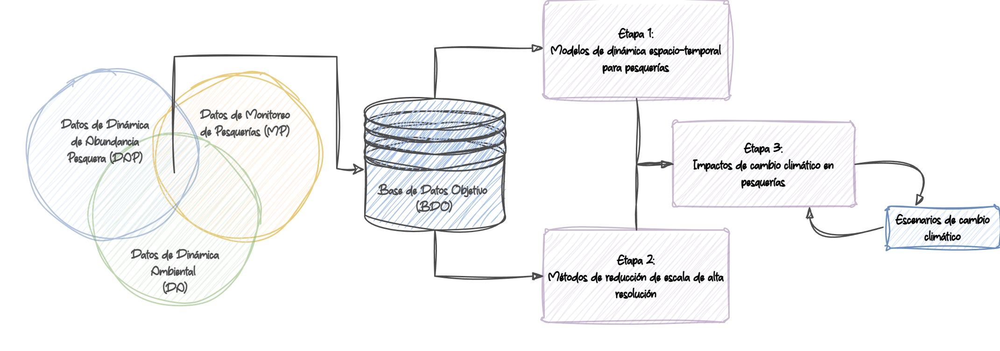{width="100%"}
:::

---

::: {.fragment}

Estas son las preguntas que guían el proyecto

:::

::: {.fragment}
1. ¿Qué relaciones existen entre ambiente y recursos marinos?
:::

::: {.fragment}
2. ¿Cómo podemos construir mejores modelos y proyecciones a escala regional?
:::

::: {.fragment}
3. ¿Qué escenarios futuros podríamos explorar frente al cambio climático?
:::

---

## Más que resultados, una forma de hacer ciencia

:::: {.columns .v-center}
::: {.column width="40%"}

Intersección entre:

- **océano**, **pesca** y **clima**
- **datos y modelos**
- **computación**
- y **preguntas relevantes** para **Chile**

:::

::: {.column width="60%"}

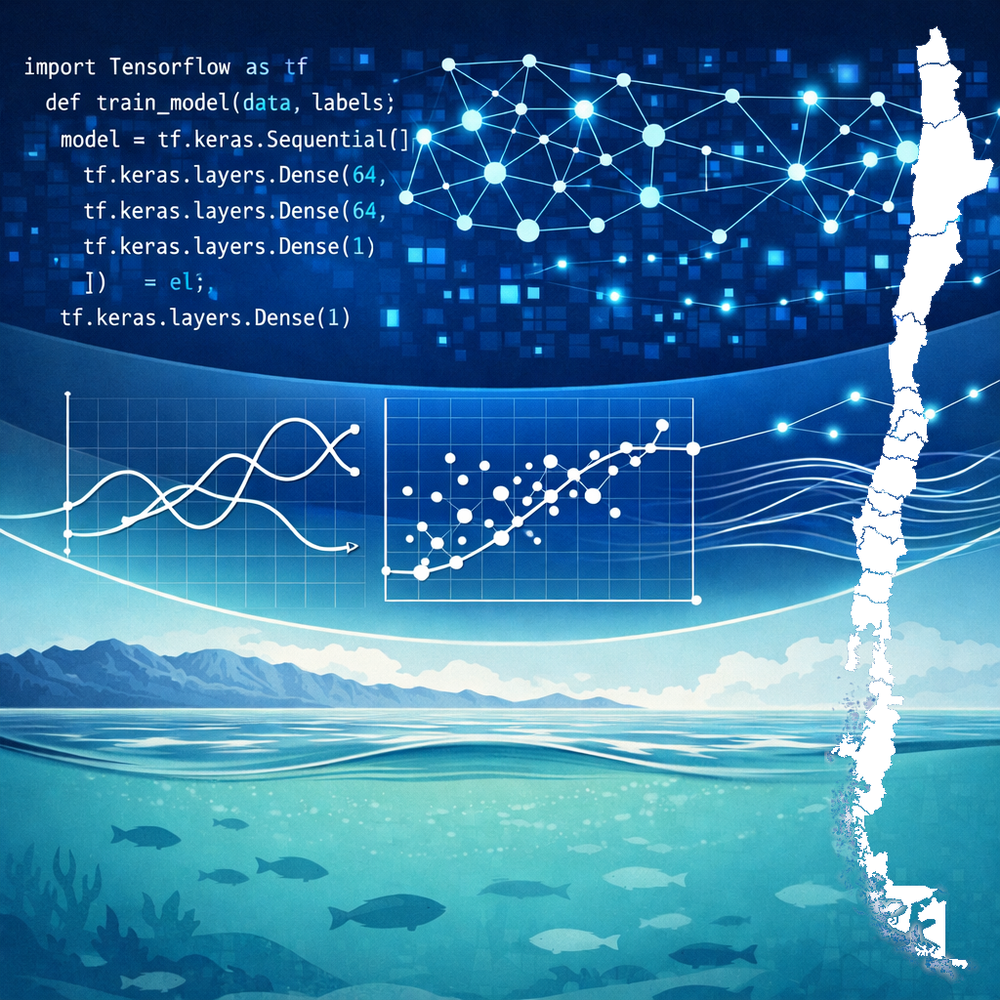{width="80%" style="border-radius: 12px; box-shadow: 0 6px 18px rgba(0,0,0,0.18);"}

:::
::::

# Ejemplos de ciencia aplicada {background-color="#212f4b" background-image="images/background_fish.gif" background-size="cover" background-opacity="0.18"}

## Cómo abordamos estos problemas

:::: {.columns}

::: {.column width="25%"}
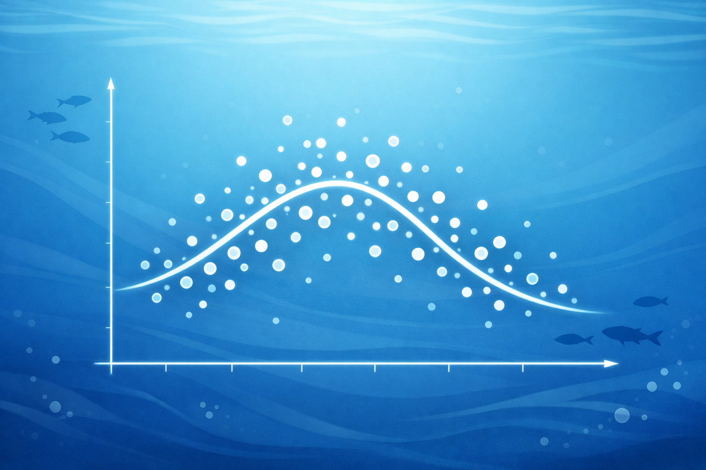{style="width:100%; border-radius:10px;"}

**Relaciones**  
Ambiente ↔ abundancia
:::

::: {.column width="25%"}
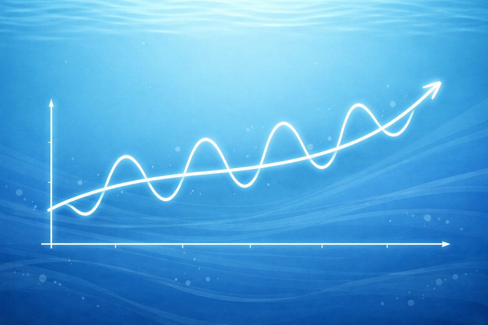{style="width:100%; border-radius:10px;"}

**Dinámica**  
Memoria y cambio
:::

::: {.column width="25%"}
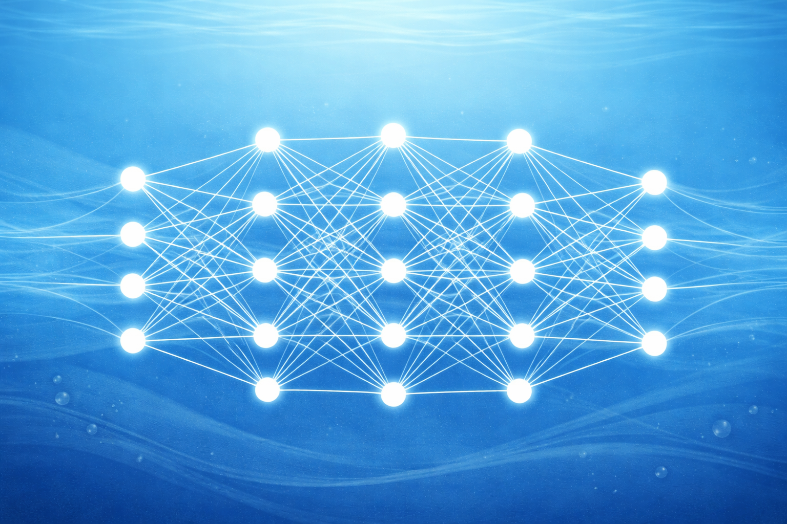{style="width:100%; border-radius:10px;"}

**Patrones**  
Aprendizaje automático
:::

::: {.column width="25%"}
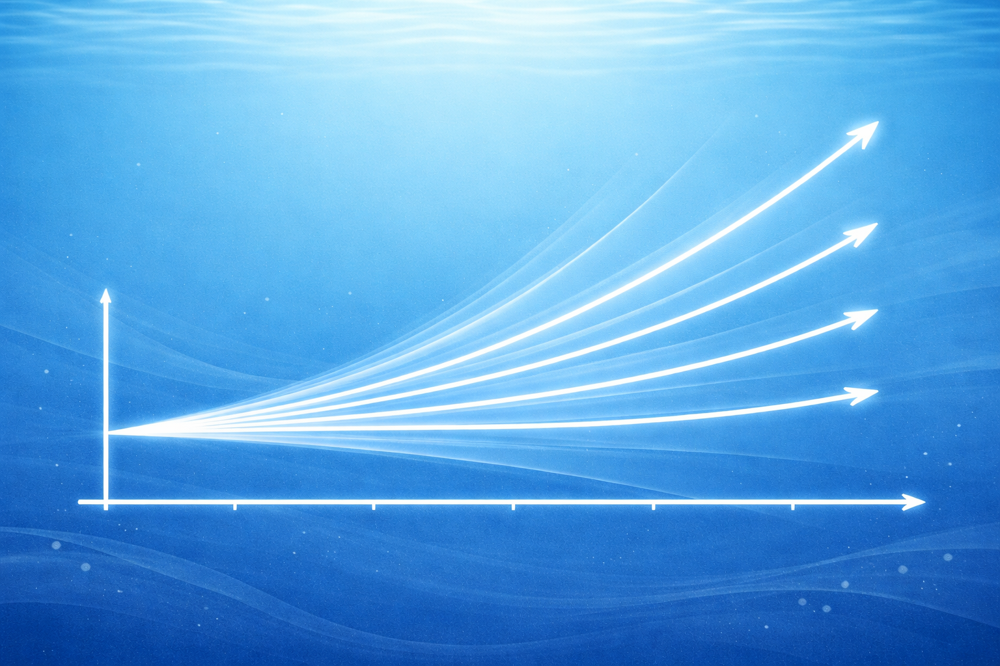{style="width:100%; border-radius:10px;"}

**Futuros**  
Escenarios posibles
:::

::::

---

## Ejemplos de cómo estas herramientas ya se han usado

:::: {.columns}

::: {.column width="25%"}
::: {.fragment .fade-up fragment-index=1}
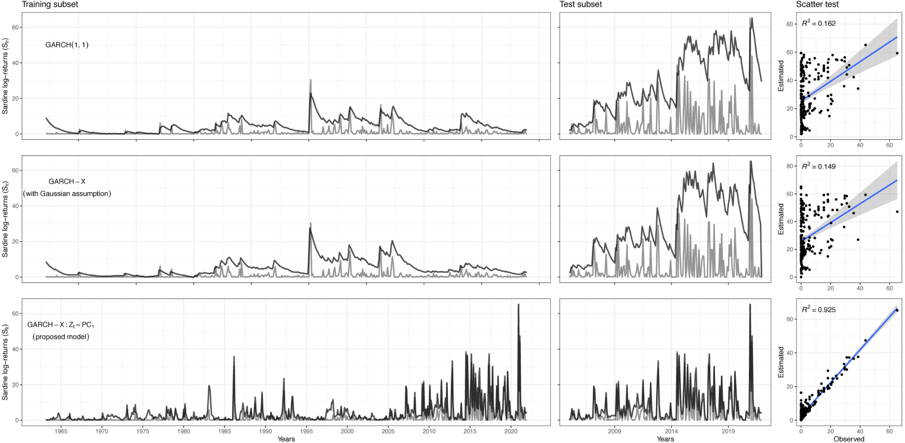{style="width:100%; height:170px; object-fit:cover; border-radius:10px;"}

**Ambiente y abundancia**  
Variabilidad de anchoveta y sardina asociada al ambiente e interacciones.

\small @PlazaVega2024

:::
:::

::: {.column width="25%"}
::: {.fragment .fade-up fragment-index=2}
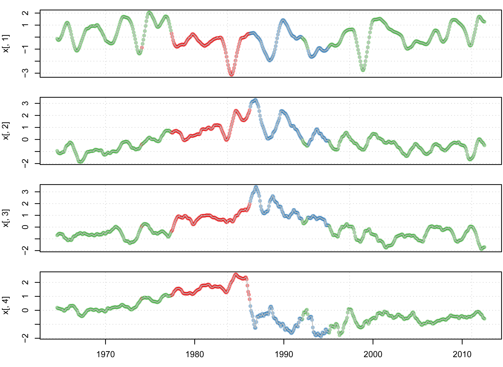{style="width:100%; height:170px; object-fit:cover; border-radius:10px;"}

**Series de tiempo y patrones**  
Identificación de patrones ecosistémicos en anchoveta y sardina.

\small @Plaza2018

:::
:::

::: {.column width="25%"}
::: {.fragment .fade-up fragment-index=3}
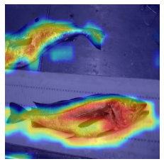{style="width:100%; height:170px; object-fit:cover; border-radius:10px;"}

**Aprendizaje automático**  
Clasificación automática de especies en pesquerías del centro-sur de Chile.

\small @alvarado2025deep

:::
:::

::: {.column width="25%"}
::: {.fragment .fade-up fragment-index=4}
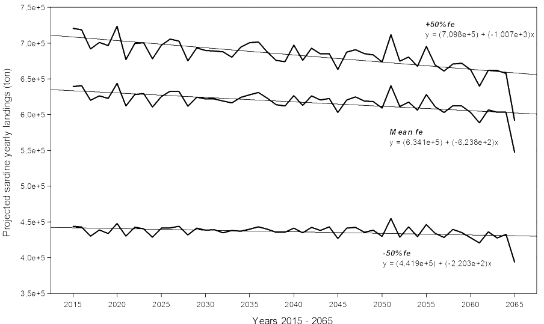{style="width:100%; height:170px; object-fit:cover; border-radius:10px;"}

**Escenarios futuros**  
Exploración de posibles trayectorias de desembarques bajo cambio climático.

\small @Yanez2016

:::
:::

::::

---

## Del problema a la colaboración

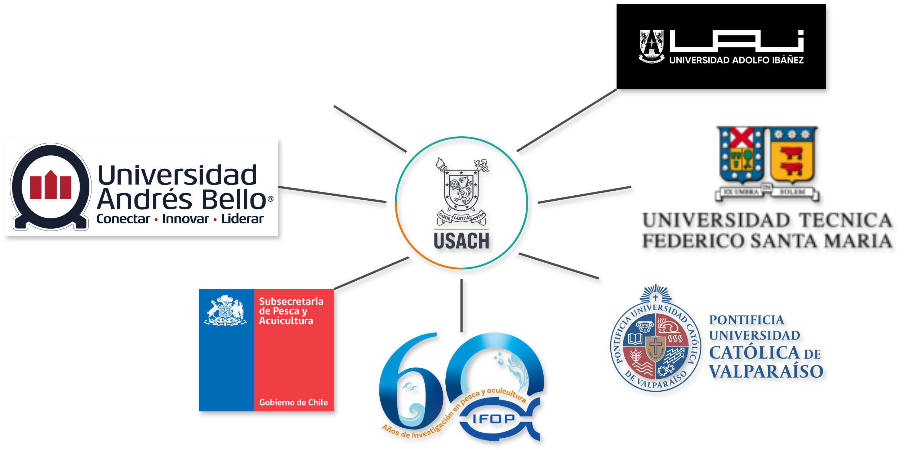

---

## También hay espacio para divulgación y ciencia abierta

::: {.callout-tip appearance="minimal"}
**Hacer ciencia no es solo modelar o programar.**

También implica:

- comunicar ideas complejas de manera clara;
- compartir conocimiento;
- trabajar con otras personas;
- y construir una cultura científica abierta, crítica y colaborativa.
:::

# ¿Y ustedes? {background-color="#212f4b" background-image="images/background_fish2.gif" background-size="cover" background-opacity="0.18"}

## Lo que podrían empezar a construir desde ahora

:::: {.columns}

::: {.column width="45%"}

Durante su formación podrían acercarse a:

- programación y análisis de datos;
- modelación y simulación;
- visualización e interpretación;
- investigación aplicada;
- trabajo interdisciplinario;
- divulgación científica.

:::

::: {.column width="55%"}

:::{.fragment .fade-up}
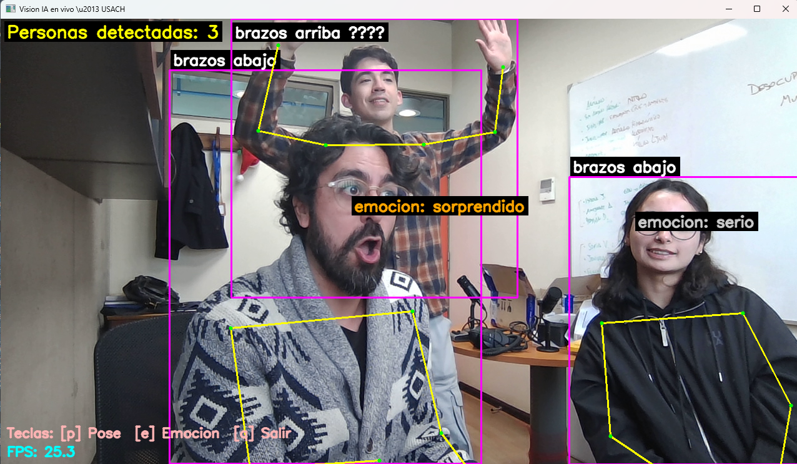{style="width:100%; border-radius:12px;"}
:::

:::

::::

---

## El mensaje final

::: {.callout-tip appearance="minimal"}

Tal vez hoy todavía no sepan exactamente qué camino seguirán.

Pero en esta Facultad sí pueden empezar a construir herramientas, preguntas y formas de mirar el mundo que, con el tiempo, les permitan comprender problemas reales y aportar a transformarlos.

:::

---

## {background-image="images/tu_fondo.png" background-opacity="0.35"}

  
Háganse preguntas.

  
Exploren.

  
Conversen.

  
Colaboren.

  
Diviértanse.

---

## No duden en acercarse a sus profes: en la Facultad encontrarán personas dispuestas a escucharlos, orientarlos y acompañarlos en el desarrollo de sus inquietudes.

### (y también estudien)

---

## 

# De eso se trata la Universidad.

# De aprender, descubrir,  
# preguntar y construir juntos.

# ¡BIENVENID@S a la USACH  
# y a la Facultad de Ciencia!

---

## Gracias {.unlisted background-color="#212f4b" background-image="images/background_fish.gif" background-size="cover" background-opacity="0.2"}

**Del mar a los datos** también es una invitación:

**a mirar problemas reales con curiosidad, herramientas científicas y ganas de aportar.**

francisco.plaza.v@usach.cl

# References {background-color="#212f4b" background-image="images/background_fish.gif" background-size="cover" background-opacity="0.2"}

::: {#referencias}
:::
